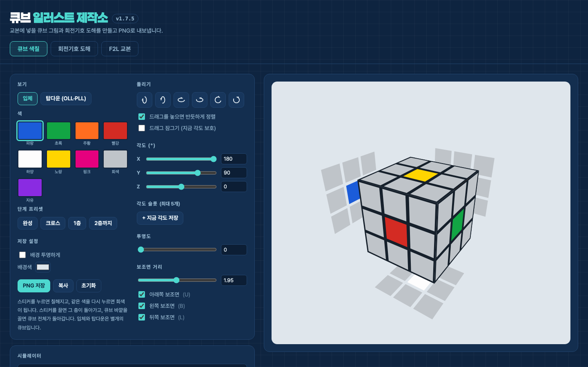

# 큐브 일러스트 제작소

큐브 교본·강의 자료에 넣을 그림을 브라우저에서 바로 만들고 PNG로 내보내는 도구입니다.

**👉 바로 쓰기: https://pauleum00-sketch.github.io/cube-illustrator/**

큐브 과외를 하며 3x3 초급해법 교본을 직접 쓰다가, 교본에 넣을 큐브 그림(입체 색칠 도해, OLL·PLL 탑다운 도해, 회전기호 도해)을 그려주는 도구가 없어서 만들었습니다. 설치 없이 웹에서 쓸 수 있고, 파일 하나(`cube-illustrator.html`)로 이루어진 순수 HTML/JS라 내려받아 오프라인으로 써도 됩니다.

## 주요 기능

- **입체 뷰 색칠**: 스티커를 클릭해 색칠하고, 드래그로 층을 돌리거나 큐브 전체를 자유 회전. 각도 슬라이더·각도 슬롯 저장, 보조면(가려진 면 펼쳐 보기)·투명 모드 지원
- **시뮬레이터**: 회전기호를 적용·역적용(케이스 자동 생성)하고 애니메이션으로 재생. 완성/크로스/1층/2층까지 단계 프리셋 제공
- **탑다운 뷰 (OLL·PLL 도해)**: 윗면 + 옆면 윗줄을 내려다본 표준 도해 형식. 스티커 두 개를 눌러 PLL 교환 화살표를 그릴 수 있음
- **회전기호 도해**: `R U2 R' U' R U R'` 같은 공식을 입력하면 수별 도해를 자동 생성. 두 층·가운데층·큐브 전체 회전 지원
- **F2L 교본 생성**: 41개 F2L 케이스 중 원하는 것을 골라 번호·그림·공식 표를 만들고 프린트/PDF로 내보내기
- **PNG 내보내기**: 3배 해상도 저장·클립보드 복사, 배경 투명 옵션. 작업 내용은 브라우저에 자동 저장

## 사용 기술

- 순수 HTML / CSS / JavaScript — 프레임워크·빌드 도구·서버 없음
- SVG 기반 큐브 렌더링, Canvas 기반 PNG 내보내기
- localStorage 자동 저장

## 실행 방법

배포된 페이지(https://pauleum00-sketch.github.io/cube-illustrator/)를 열거나, 저장소를 내려받아 `cube-illustrator.html`을 브라우저로 열면 됩니다. 빌드·서버가 필요 없습니다.

## 업데이트 내역

[CHANGELOG.md](CHANGELOG.md)에서 확인할 수 있습니다.
